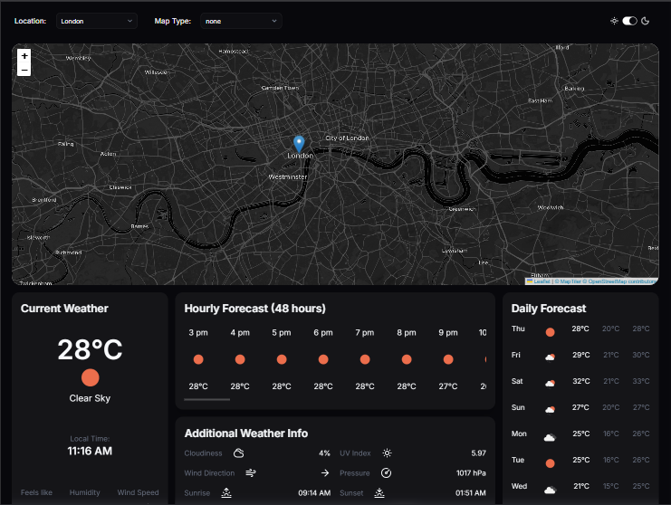
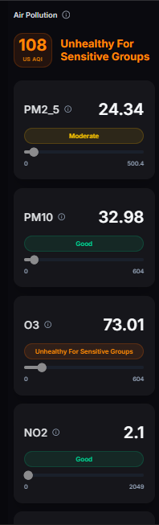

# Nimbus — Real-Time Weather App

Weather dashboard with an interactive Leaflet map, meteorological overlay layers, per-pollutant US EPA AQI calculation, and isolated component-level error handling. Built with React, TypeScript, and TanStack Query.

[](https://nimbus-weatherapp.vercel.app/)

---

## Preview

| Dashboard | Air Quality Panel |
|---|---|
|  |  |

---

## Features

- **Current Weather** — Temperature, feels-like, humidity, wind speed, UV index, pressure, cloud cover, sunrise/sunset, and local time rendered in the location's own timezone via `Intl.DateTimeFormat`.
- **48-Hour Hourly Forecast** — Horizontally scrollable card with per-hour temperature and weather icon.
- **8-Day Daily Forecast** — Min/max/day temperature and weather condition per day.
- **Interactive Leaflet Map** — Click anywhere on the map to instantly query weather and air quality for that location. Pans smoothly to the new coordinates on selection.
- **5 Meteorological Overlay Layers** — Clouds, Precipitation, Temperature, Pressure, and Wind Speed tile layers from OpenWeatherMap, with a dynamically generated colour-scale legend per layer.
- **US EPA Air Quality Index** — Side panel with real-time AQI for six pollutants, each with an individual concentration reading, qualitative rating badge, and progress bar scaled to the hazardous breakpoint ceiling.
- **Dark/Light Mode** — Theme persisted in `localStorage`, defaulting to dark. The MapTiler base map tile layer also switches between dark and light styles in sync with the theme.

---

## Tech Stack

| Layer | Technology |
|---|---|
| Framework | React 19, Vite |
| Language | TypeScript |
| Server State | TanStack Query v5 |
| Runtime Validation | Zod |
| Styling | Tailwind CSS v4, Shadcn/UI |
| Interactive Map | React Leaflet, Leaflet, MapTiler SDK |
| Icons & UI Primitives | Lucide React, Radix UI |

---

## Architecture

Nimbus consumes three separate OpenWeatherMap APIs. The key architectural decision is that **a single piece of state — the user's coordinates — drives all three fetch calls**. No global store is needed.

```
User selects city (dropdown) ──→ location string
                                        │
                              Geocoding API (/geo)
                                        │
                                   coords { lat, lon }
                                        │
                    ┌───────────────────┼───────────────────┐
                    │                   │                   │
             Weather API          Weather API          Air Pollution API
           (CurrentWeather)     (HourlyForecast,     (SidePanel/AQI)
                                 DailyForecast,
                                 AdditionalInfo)
```

The three Weather API components share the identical query key `["realData", lat, lon]`, so TanStack Query deduplicates them into a single network request regardless of how many components mount simultaneously.

Clicking on the map bypasses geocoding entirely — coordinates are set directly from the `LeafletMouseEvent` and the `location` state is set to `"Custom"`, which disables the geocoding query via `enabled: location !== "Custom"`.

---

## Technical Highlights

### Custom US EPA Air Quality Index Calculation

This is the most non-trivial piece of the application. OpenWeatherMap returns raw pollutant concentrations in μg/m³ for all six pollutants, but the US EPA AQI standard requires different units for different gases — CO must be in ppm, and NO₂, SO₂, O₃ must be in ppb. Nimbus handles this with a custom `processAirPollutionData` utility:

**Step 1 — Unit conversion** using molar volume at standard ambient conditions (25°C, 1 atm):

```typescript
// For CO (molecular weight: 28.01), result in ppm (divide by 1000)
if (key === "co") return (value * 24.45) / pollutant.molecularWeight! / 1000;
// For NO₂, SO₂, O₃, result in ppb
else return (value * 24.45) / pollutant.molecularWeight!;
// PM2.5 and PM10 are already in μg/m³ — no conversion needed
if (key === "pm2_5" || key === "pm10") return value;
```

**Step 2 — Linear interpolation** against the EPA's published breakpoint table. For each pollutant, the converted concentration is mapped into a 0–500 AQI sub-index:

```typescript
const individualAQI = Math.round(
  ((AQIRange.max - AQIRange.min) / (pollutantRange.max - pollutantRange.min)) *
    (formattedValue - pollutantRange.min) + AQIRange.min,
);
```

**Step 3 — Critical pollutant method.** The reported AQI is the maximum sub-index across all six pollutants:

```typescript
const mainAQI = Math.max(...components.map((c) => c.individualAQI));
```

This matches the exact methodology the US EPA uses to calculate the AQI values reported in official air quality monitors.

---

### Runtime Schema Validation via Zod

TypeScript types are erased at runtime. A shape mismatch between what OpenWeatherMap sends and what the components expect would normally result in a silent `undefined` rendering as blank or causing a runtime crash with a cryptic stack trace.

Every API response passes through a Zod schema at the network boundary before it ever reaches a component:

```typescript
// api.ts — generic fetcher used by all three APIs
const data = await response.json();
return schema.parse(data); // throws ZodError if shape is unexpected
```

The three schemas (`openWeatherMapResponseSchema`, `geoDataSchema`, `AirPollutionSchema`) define the full expected shape including optional fields like `wind_gust`, `rain`, and `snow`. Fields like `uvi` use `.catch(0)` to gracefully handle rare API omissions instead of failing the whole parse.

Because the schemas live at the network layer and errors propagate up to the nearest `ErrorBoundary`, a malformed API response is always caught and presented as a clean error state — never a blank UI or a white screen.

---

### Theme-Aware Leaflet Map

The app theme is managed by a `ThemeProvider` component that reads from `localStorage` on mount (defaulting to `"dark"`), stores the value in React Context, and writes it back on toggle:

```typescript
const [themeValue, setThemeValue] = useState<Theme>(() => {
  return (localStorage.getItem("theme") as Theme) || "dark";
});
```

On theme change, a `useEffect` adds or removes the `dark` class from `document.documentElement`, which activates Tailwind's dark mode variants. This is the only piece of global client state in the app — kept intentionally minimal.

The interesting part: the `Map` component consumes `useTheme()` and uses the current theme value to swap MapTiler's base tile layer between `MapStyle.BACKDROP.DARK` and `MapStyle.BACKDROP.LIGHT`:

```typescript
const mapTiler = new MaptilerLayer({
  style: Theme === "dark" ? MapStyle.BACKDROP.DARK : MapStyle.BACKDROP.LIGHT,
  apiKey: MAPTILER_API_KEY,
});
```

This means every theme toggle also swaps the map tiles — the entire interface including the map background switches coherently, not just the UI chrome.

---

### Map Overlay Legends

When a meteorological overlay is active, a `MapLegend` component renders a positioned overlay card with a dynamically generated CSS gradient colour scale and the min/max values for the active layer. Each legend's colour stops and units are defined in a typed `WeatherLegend` record — no hardcoded strings in JSX:

```typescript
const stopGradient = data.stops
  .map((stop, index) => `${stop.color} ${(index / (data.stops.length - 1)) * 100}%`)
  .join(", ");
```

The Cloud Cover layer also applies a `dark:invert-0 invert` class when active in light mode, since the OpenWeatherMap cloud tile is white-on-transparent and would be invisible against a light map background.

---

### TanStack Query Request Deduplication

Four components — `CurrentWeather`, `HourlyForecast`, `DailyForecast`, and `AdditionalInfo` — all call the same One Call API endpoint with the same parameters. They all declare the same query key:

```typescript
queryKey: ["realData", coords.lat, coords.lon]
```

TanStack Query collapses these four simultaneous `useSuspenseQuery` calls into a single in-flight network request. When coordinates change, all four components refetch together and the cache is updated once. This also prevents the app from hitting OpenWeatherMap's rate limits under normal usage.

---

### Code Splitting and Skeleton Loaders

The Leaflet map is lazy-loaded since it carries a significant bundle weight:

```typescript
const Map = lazy(() => import("./components/Map"));
```

This keeps the initial bundle small so the weather cards render immediately on first load. Each section uses a matching skeleton component (`CurrentSkeleton`, `DailySkeleton`, `HourlySkeleton`, `SidePanelSkeleton`) as its `Suspense` fallback — skeleton dimensions mirror the real component layout to prevent Cumulative Layout Shift (CLS) when content loads in.

---

### Scoped Error Boundaries

Every data-fetching section is individually wrapped in an `ErrorBoundary`:

```tsx
<ErrorBoundary fallback={<Card>Failed to load data.</Card>}>
  <Suspense fallback={<CurrentSkeleton />}>
    <CurrentWeather coords={coords} />
  </Suspense>
</ErrorBoundary>
```

If the Air Pollution API is down or returns an error, only the AQI side panel shows a fallback — the weather cards, map, and forecasts continue working unaffected. Failures are contained to the section that caused them.
